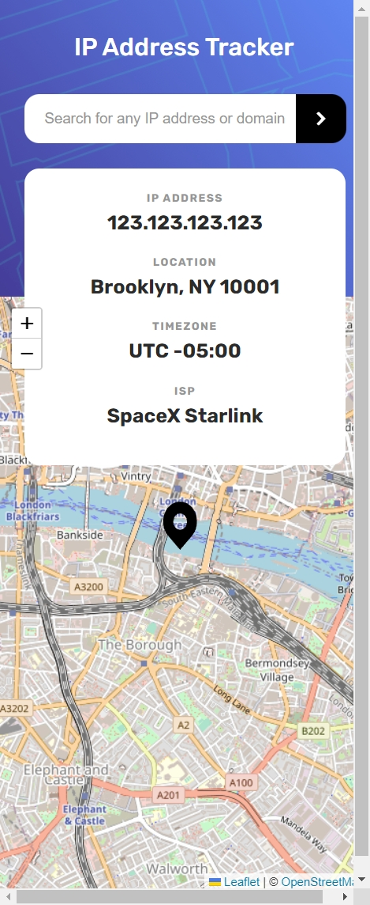
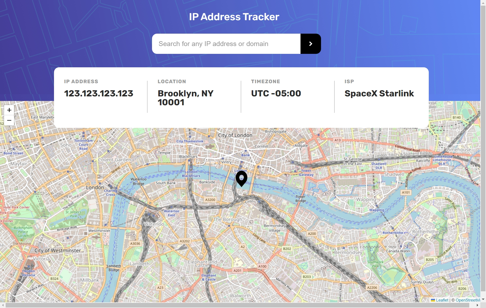

#Solução de rastreador de endereço IP

## Índice

- [Visão Geral](#visão-geral)
  - [O Desafio](#o-desafio)
  - [Screenshot](#screenshot)
  - [Links](#links)
- [Meu processo](#meu-processo)
- [Autor](#autor)

## Visão Geral

### O Desafio

Os usuários deverão ter a capacidade de:

- Visualizar o layout ideal para o site, dependendo do tamanho da tela do dispositivo;
- Ver os estados de foco para todos os elementos interativos na página;
- Pesquisar endereços IP ou domínios e ver as principais informações e localização.

### Screenshot

### Links

- Site URL: [IP tracker](https://ip-address-tracker-solution.vercel.app/)

## Meu processs

- [x] Desktop-design
- [x] Estados-ativos
- [x] Mobile-design
- [x] API-Map
- [x] API-Tracker
- [x] Interação

## Autor

- LinkedIn - [Fernando R Costa](https://www.linkedin.com/in/fernando-r-costa/)
