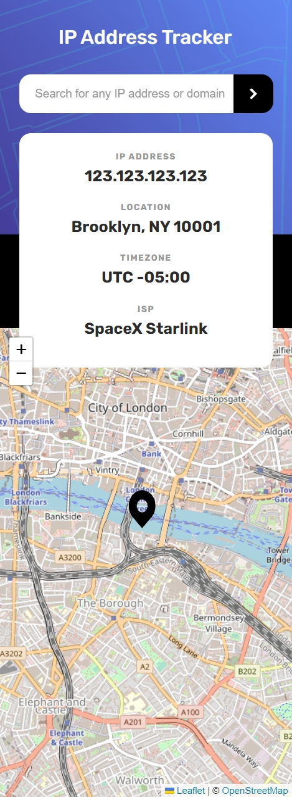
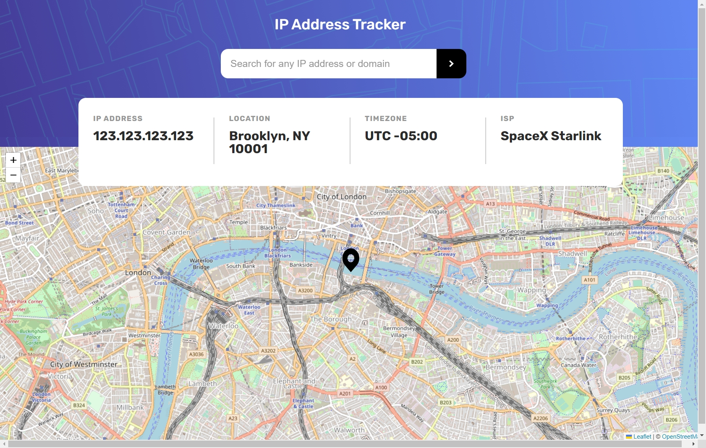

# Frontend Mentor - IP address tracker solution

This is a solution to the [IP address tracker challenge on Frontend Mentor](https://www.frontendmentor.io/challenges/ip-address-tracker-I8-0yYAH0). Frontend Mentor challenges help you improve your coding skills by building realistic projects.

## Table of contents

- [Overview](#overview)
  - [The challenge](#the-challenge)
  - [Screenshot](#screenshot)
  - [Links](#links)
- [My process](#my-process)
- [Author](#author)

## Overview

### The challenge

Users should be able to:

- View the optimal layout for each page depending on their device's screen size
- See hover states for all interactive elements on the page
- See their own IP address on the map on the initial page load
- Search for any IP addresses or domains and see the key information and location

### Screenshot

### Links

- Live Site URL: [E-commerce page](https://ip-address-tracker-solution.vercel.app/)

## My process

- [x] Desktop-design
- [x] Active-states
- [x] Mobile-design
- [x] API Map
- [x] API Tracker
- [x] Interactive

## Author

- LinkedIn - [Fernando R Costa](https://www.linkedin.com/in/fernando-r-costa/)